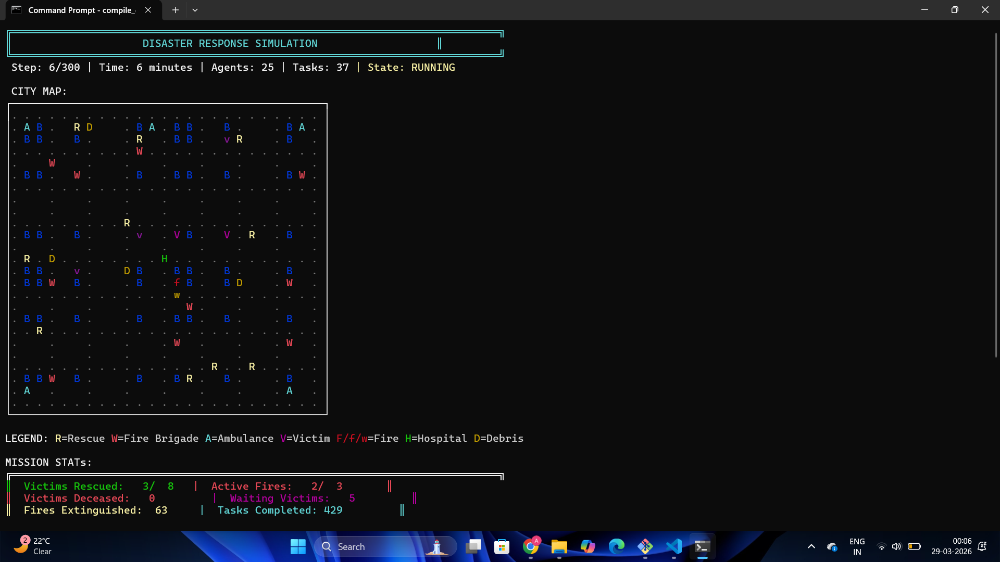
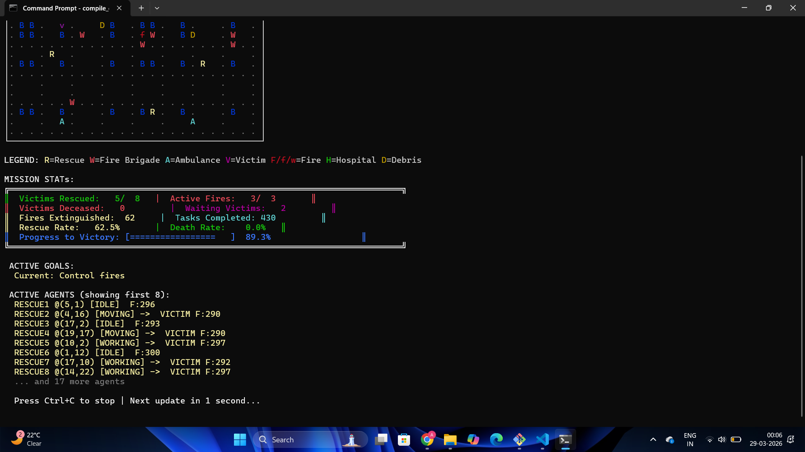
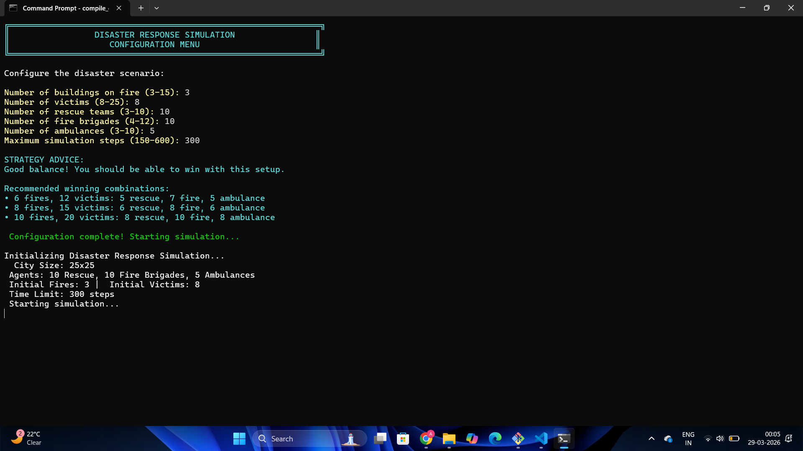

# 🚑🔥 Disaster Response Simulation (AI-Based)

An intelligent **multi-agent disaster management system** built in **C++**, simulating real-time emergency response in a dynamic city environment.
This project demonstrates how AI techniques can coordinate rescue operations efficiently under constraints like time, resources, and evolving hazards.
---

## 🧠 Core Concepts Used
* 🤖 Multi-Agent Systems
* 📦 Contract Net Protocol (Task Allocation)
* 🧭 A* Pathfinding Algorithm
* 🎯 Goal Stack Planning
* 🧱 Object-Oriented Design (OOP
---

## ⚙️ Features
* 🌆 Dynamic city grid simulation (25x25)
* 🔥 Real-time fire spread with intensity control
* 🧍 Victim health decay & urgency prioritization
* 🚒 Intelligent agents:
  * Rescue Teams
  * Fire Brigades
  * Ambulances
* 🧠 Smart task allocation based on cost & priority
* 📊 Live mission statistics dashboard
* 🎮 Interactive configuration before simulation
---

## 🖥️ Simulation Preview

### 🔹 City Map & Live Agents



### 🔹 Mission Stats Dashboard



### 🔹 Configuration Menu



---

## 🧩 System Architecture

* **Grid-Based Environment**
* **Task Generator**
* **Contract Net Task Allocator**
* **Agent Layer (3 types)**
* **A* Pathfinding Engine**
* **Goal Planner**

---

## 🚀 How to Run

### 🛠️ Requirements

* Windows OS (uses `windows.h`)
* C++ Compiler (g++ / MinGW)

### ▶️ Compile & Run

```bash
g++ main.cpp -o simulation
./simulation
```

## 🏆 Objective output
* Efficient task allocation using AI principles
* Real-time simulation with multiple interacting agents
* Scalable design for future GUI / Web integration
---

## 🔮 Future Improvements
* GUI using SFML / OpenGL
* Web dashboard (React + backend)
* Machine Learning for smarter decisions
* Real map integration (GIS data)

